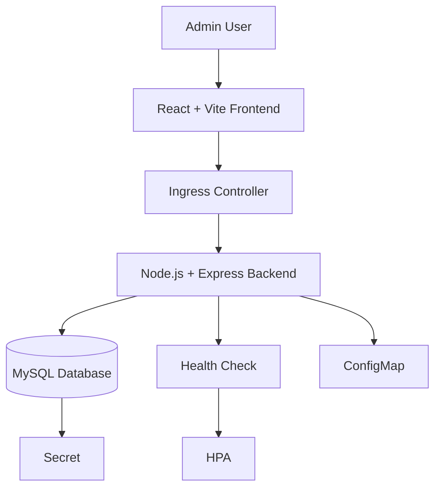

# EcoTrack - Smart Waste Monitoring System

EcoTrack is a modern admin dashboard for monitoring waste reports. The project is aligned with the following SDGs:

- SDG 11: Sustainable Cities and Communities
- SDG 12: Responsible Consumption and Production

The application is intentionally kept simple with one admin role so the focus stays on Kubernetes implementation, scaling, and deployment quality.

## Architecture Diagram



## Project Structure

```text
ecotrack/
├── frontend/
├── backend/
├── k8s/
├── docker-compose.yml
├── README.md
```

## Main Features

- Admin dashboard only
- Add waste reports
- View reports in a table
- Update report status
- Delete reports
- Dashboard statistics
- Responsive eco-themed UI
- Dummy sample data fallback

## Local Setup

### Prerequisites

- Node.js 20+
- MySQL 8+
- npm

### 1. Backend setup

```bash
cd backend
cp .env.example .env
npm install
npm run dev
```

### 2. Frontend setup

```bash
cd frontend
cp .env.example .env
npm install
npm run dev
```

### 3. MySQL setup

Run the schema and seed files from `backend/sql/`:

- `schema.sql`
- `seed.sql`

## Docker Setup

Build and start the full stack:

```bash
docker compose up --build
```

Access URLs:

- Frontend: http://localhost:3000
- Backend API: http://localhost:5000
- Health check: http://localhost:5000/health

## Kubernetes Deployment Steps

1. Create the namespace:

```bash
kubectl apply -f k8s/namespace.yaml
```

2. Apply config and secret:

```bash
kubectl apply -f k8s/configmap.yaml
kubectl apply -f k8s/secret.yaml
```

3. Create storage for MySQL:

```bash
kubectl apply -f k8s/mysql-pvc.yaml
```

4. Deploy MySQL:

```bash
kubectl apply -f k8s/mysql-deployment.yaml
kubectl apply -f k8s/mysql-service.yaml
```

5. Deploy backend:

```bash
kubectl apply -f k8s/backend-deployment.yaml
kubectl apply -f k8s/backend-service.yaml
```

6. Deploy frontend:

```bash
kubectl apply -f k8s/frontend-deployment.yaml
kubectl apply -f k8s/frontend-service.yaml
```

7. Deploy ingress and autoscaling:

```bash
kubectl apply -f k8s/ingress.yaml
kubectl apply -f k8s/hpa.yaml
```

## Useful kubectl Commands

```bash
kubectl get namespace
kubectl get pods -n ecotrack
kubectl get svc -n ecotrack
kubectl get ingress -n ecotrack
kubectl get hpa -n ecotrack
kubectl logs deploy/ecotrack-backend -n ecotrack
```

## HPA Testing Steps

1. Check the autoscaler status:

```bash
kubectl get hpa -n ecotrack
```

2. Watch backend pods scale:

```bash
kubectl get pods -n ecotrack -w
```

3. Run a load test from a machine that can reach the ingress URL:

```bash
ab -n 5000 -c 50 http://APP_URL/
```

4. Watch metrics and scaling behavior during traffic spikes.

## API Endpoints

- `GET /health`
- `GET /api/reports`
- `POST /api/reports`
- `PUT /api/reports/:id`
- `DELETE /api/reports/:id`

## Notes for Demo

- Show the dashboard UI first.
- Demonstrate report creation and status updates.
- Show `kubectl get hpa` and `kubectl get pods -w` during load testing.
- Explain how Ingress routes traffic to frontend and backend services.

## Beginner-Friendly Tips

- Use `ecotrack.local` as the Ingress host in local Kubernetes.
- If you use Minikube, make sure the ingress addon is enabled.
- If the frontend shows sample data, the API backend is likely not reachable yet.
